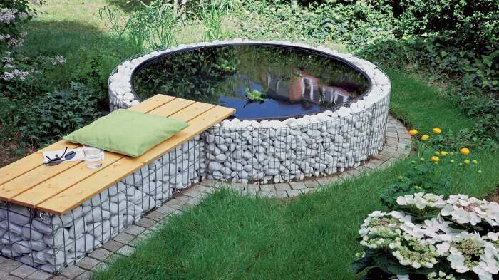
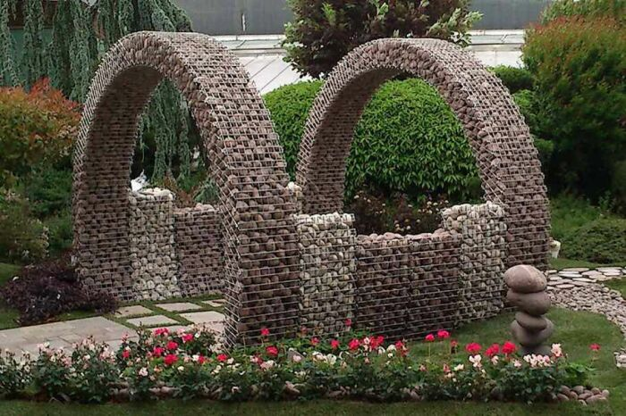

# Original ideas for using gabions on the garden plot

A gabion is a frame made of mesh and filled with stones. It is a very reliable and durable structure, which with a little imagination can be an excellent design solution for the design of the suburban area. With gabions you can perform a protective function, fix landscape irregularities, improve noise isolation and make rather original compositions in combination with trees, flowers and other materials. Novate.ru offers a selection of creative ideas that will help inspire and make really cool designs.

## Bench from gabions

Gabions are a great basis for creating a budget-friendly and durable bench. It can be made in any size and shape, with no doubts about its durability. It is best to cover the bench with planks on top. The bench can be with or without a backrest.

Textile elements in the form of soft and bright cushions or plaids will help to complete the picture.

## Constructions from stones

Few people can do without a warehouse or utility room on the dacha site. All the necessary things for taking care of the plants and home, such as gardening tools, equipment, firewood and tools, are usually collected there. To keep them always in a safe hiding place and kept in an organized order, you can build a mini-warehouse out of gabions for them. Such a solution will cost a budget, but will be durable and reliable.

## Gabion Pond

The pond is a real decoration of any dacha plot. However, to make it quite often you have to make too much effort and spend a lot of money. To restore beauty and avoid all the unpleasant problems, you can call on the help of gabions. With them, any form of pond becomes available and easy to implement. With them, no special construction skills are required - everything can be easily realized with your own hands. The original solution would be to combine the pond with a gabion bench: both beautiful and practical.

## Arches from gabions

From gabions you can make very beautiful arches, which will decorate any cottage plot or garden. They perfectly combine with other landscape ideas, flowers and greenery. It turns out very natural and unusual. Gabion arches can take absolutely any shape and size, the main thing is to connect your imagination and fantasy. A special role in this matter is played by stones: their shape, color and size. They should be chosen so that they fit in with their surroundings.

Small stones will look more stylish, and large stones will add monumentality to the surroundings.

